# MLF_Grayscale_Image_Colorization
Automatic colorization of grayscale images to output RGB images

## Introduction

The project intends to realize automatic colorization of grayscale images. Workflows of the project is as follows. The major task is to find a mapping from the grayscale channel to the other two color channels of a full color image.
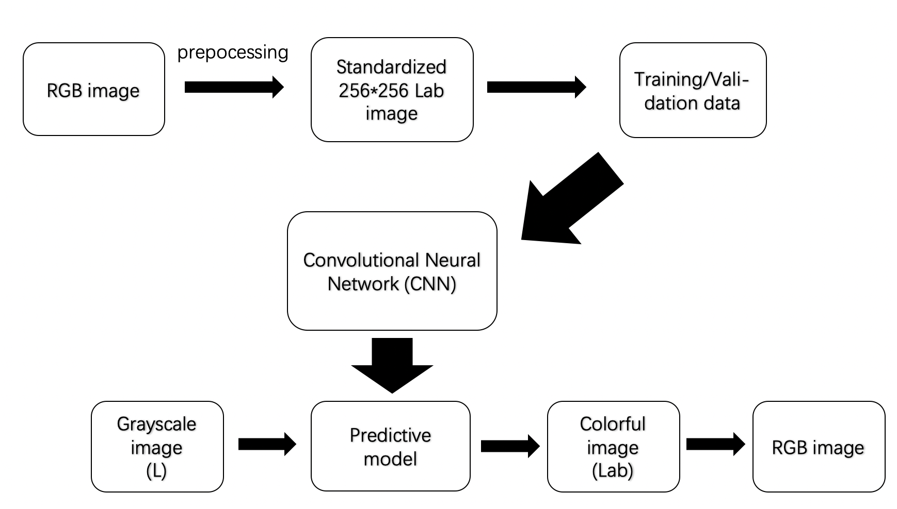

The CNN model employed here utilizes the structure of a ResNet18 model. First half of the model is transplanted from the first six layers of a ResNet18 model, so as to extract mid-level features of an image. Second half of the model is upsampling. For more details, please visit Luke Melas-Kyriazi's homepage(https://lukemelas.github.io/). The model here modifies Luke's model with respect to   
+ definition of parsers: args.epochs is a parameter for number of epochs in a call of main(), not the index for maximum epochs in a call.
+ save checkpoints: save the best model only.
+ validation: plot log losses against epochs to have a better visulization of validation performance.

## Results

||1|2|3|4  
---|---|---|---|---
Input|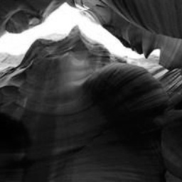|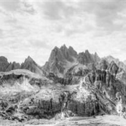|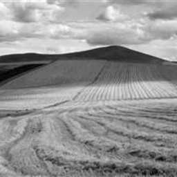|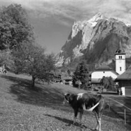
60 epochs|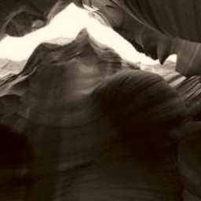|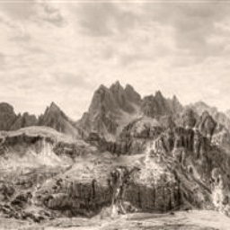|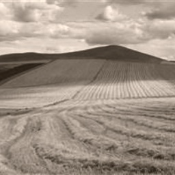|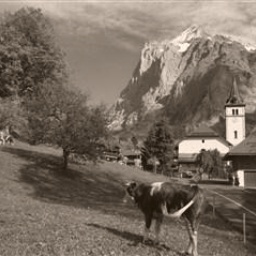
110 epochs|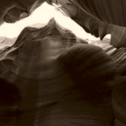|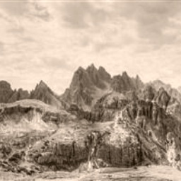|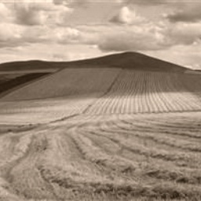|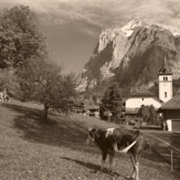
210 epochs|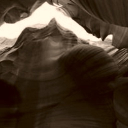|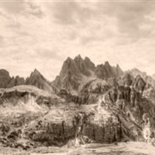|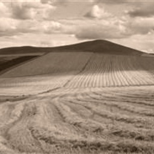|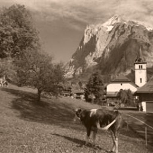
Ground truth|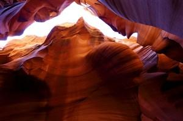|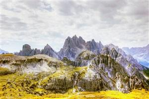|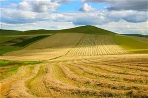|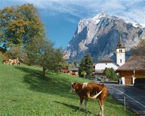

## Commments

+ Model performace is not satisfactory. Regression loss converges to a level below 0.01 after 67 epochs, but difficult to improve further.
+ A possible reason is that training/validation set is of too small size. When the model is trained on 228 images, validated on 36 images, and tested on 36 images, there is still little improvement.  To further enlarge size of data sets could be an improvement. 
+ Use k-fold validation instead of hold-out method. 
+ It may be better to increase layers borrowed from the ResNet18 model, so that deeper features of images can be extracted.  

Other possible improvements include
  
+ Changes the loss function, since sharp colors are punished severely by MSE, often resulting in 'yellow' output. For example, we could transfer the model from regression to classification by using cross entropy as loss function, and then make point estimate of each pixel from the classfication result.
+ Weighted sampling of pixels(background vs. non-background), since number of background points are usually of a higher order than that of non-background points, which introduces bias into results.

## References
+ Luke Melas-Kyriazi (https://lukemelas.github.io/)
+ Zhang, R., Isola, P., & Efros, A. A. (2016). Colorful image colorization. 649-666.
